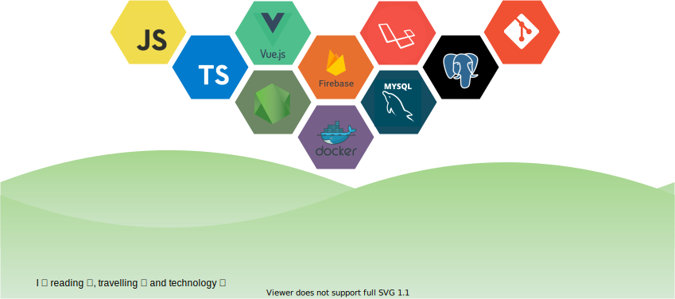

   

# 👨🏻‍💻 About me

**💻 full stack developer @Independent | You can hire me.**

  <figure style="position: relative; float: right; margin: 1rem; min-width: 250px; max-width: 300px">
    
  </figure>

  Fast learner and eager to explore new technologies.

  Like to share knowledge.

  Able to switch between perfectionism and pragmatism. Believer in agile software development, team work and Clean Code.

  Always questioning the status quo and wanting to improve.

  Able and willing to think outside the box.

  Steadily growing into Fullstack development and recently into VueJS, Typescript, NodeJS and PHP/Laravel.

### A little bit more

* 🔭 Currently working on improving my web skill set.
* 💼 Have a Bachelor's degree in Computer Science since 2007;
* 📚 Currently reading Clean Architecture, Robert C. Martin
* 🌐 Learning more about Cloud Architecture, Systems Design and Testing Development-Driven
* 🤔 Exploring new technologies and developing software solutions and quick hacks.
* 🌱 Currently learning more about Typescript, C#, .NET Core, Angular, Python, Django and Docker containers.
* 👯 Willing  to work on free-lance projects and collaborate on building open source projects. I also look forward for a job.
* 📌 Interests: DDD, TDD, Design and Architecture Patterns, UX, UI Design, Microservices
* 💬 Ask me about web development, and tech related technologies.
* 📝 My [Resume](./assets/resume.pdf)
* 📫 How to reach me: trepichio@gmail.com
* ⚡ Fun fact: I use tabs over spaces

# 💡 Goals for 2020
* Build 10+ projects
* Become skilled in JavaScript (Frontend, Backend and Testing)
* Complete coding two bootcamps by September 2020
  - Fullstack Banco Carrefour by Digital Innovation One - **done!**
  - NodeJS Web Developer by Digital Innovation One - **in progress**

## My Tech Stacks

<figure style="min-width: 300px; margin: 0">
  
</figure>

## Other technologies

                             

  <figure style="min-width: 150px; margin: 0; padding: 0.5rem">
    
  </figure>
  <figure style="min-width: 150px; margin: 0; padding: 0.5rem">
    

  </figure>

Connect with me  

  
  

  
  

  
  

  
  

